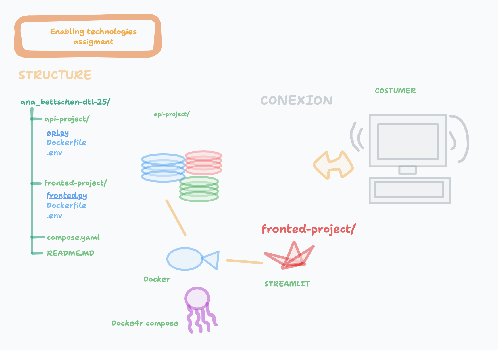

# Enable Technologies — Assignment 1 

##  Project Overview
This project implements two services using "Docker" and "frontend built" 
with "Streamlit". Then we used a backend API built with Flask which will 
help us to connect to OpenRouter’s AI API

The application will help to the users to send a text input to the AI 
model and our sytem will generated a response in a Streamlit web 
interface.

### Our features: 
Our system has a Chat interface using Streamlit
It Will connect to the OpenRouter Api
There existe variables from env. that it will be able to 
read.
Its capable to have the fronted and the backen dockerized
Is a really friendly local setup with Docker compose

-We downloaded Python 3.9, pipenv, Docker and Docker compose.
The accounts that we made are in OpenRouter, api key, google cloud

#### Environment variables:
I created an .env file in the folder of 
enable-technologies.
which will be this one:
API_BASE_URL=https://openrouter.ai/api/v1
OPENROUTER_TOKEN=(here was written my api-key)
The important part here is not to share the API_KEY it can be dangerous.

-Run locally
In the next step I had to install dependencies with the following values:
pip install -r requirements.txt
Run the API like this:
python3 api.py
and run the fronted like this:
streamlit run frontend.py
Here we built the containers and start them with the systems that were already downloaded.

##### Docker setup:
The part from the Docker started by this step asking 
Docker to build and 
run both services:
docker compose up --build
We used the comand docker compose up--build 

This process was able to start 
*Flask API (BACKEND)
*Streamlit (FRONTED)

###### Github
We clone the Github in a repository to start the aplication
We used port 8502 streamlit
we used 5050 Flask API
AND THEN WE HAD FINALLY THE ACCESS 

####### Author 

GitHub: Ana280998
Docker Hub: ana280998
Google Cloud VM: anacloud (IP: 34.141.84.162)

##  Architecture

User → Streamlit Frontend → Flask API → OpenRouter API (AI Model)

